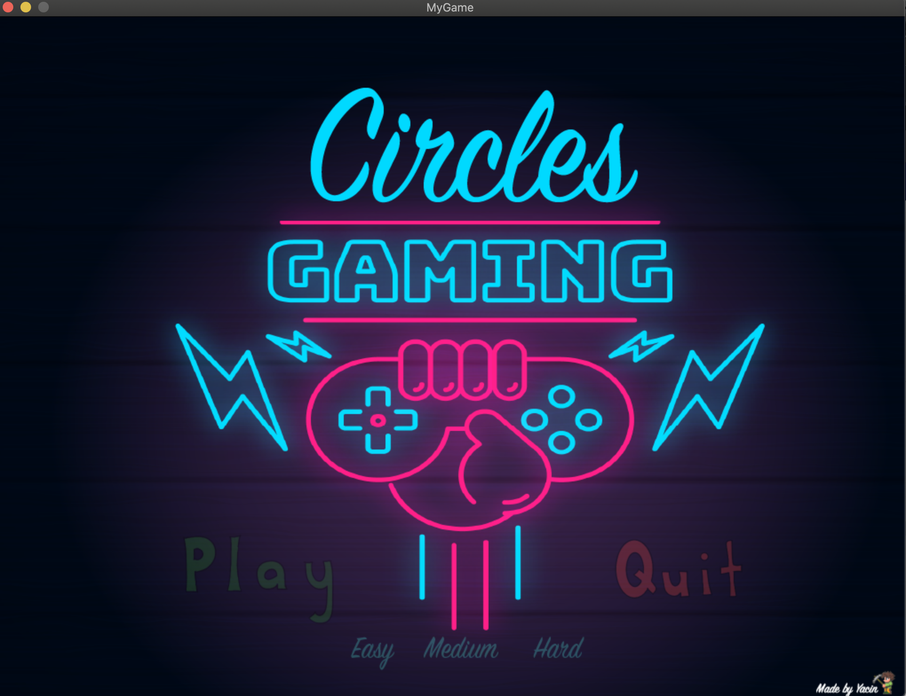
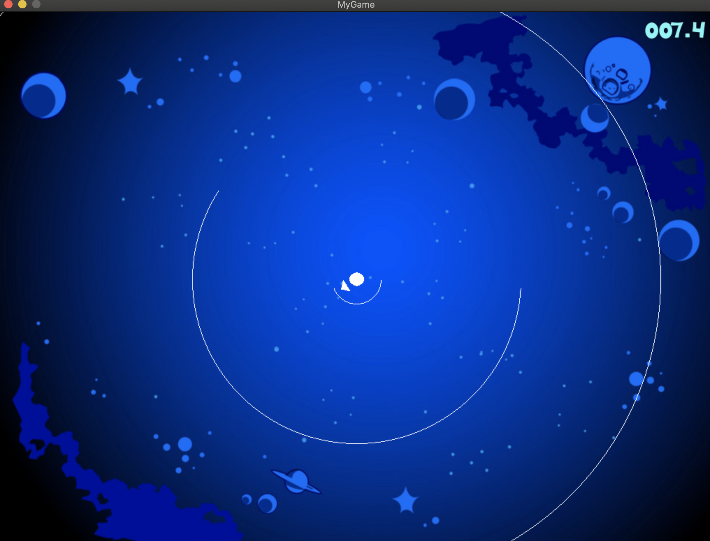
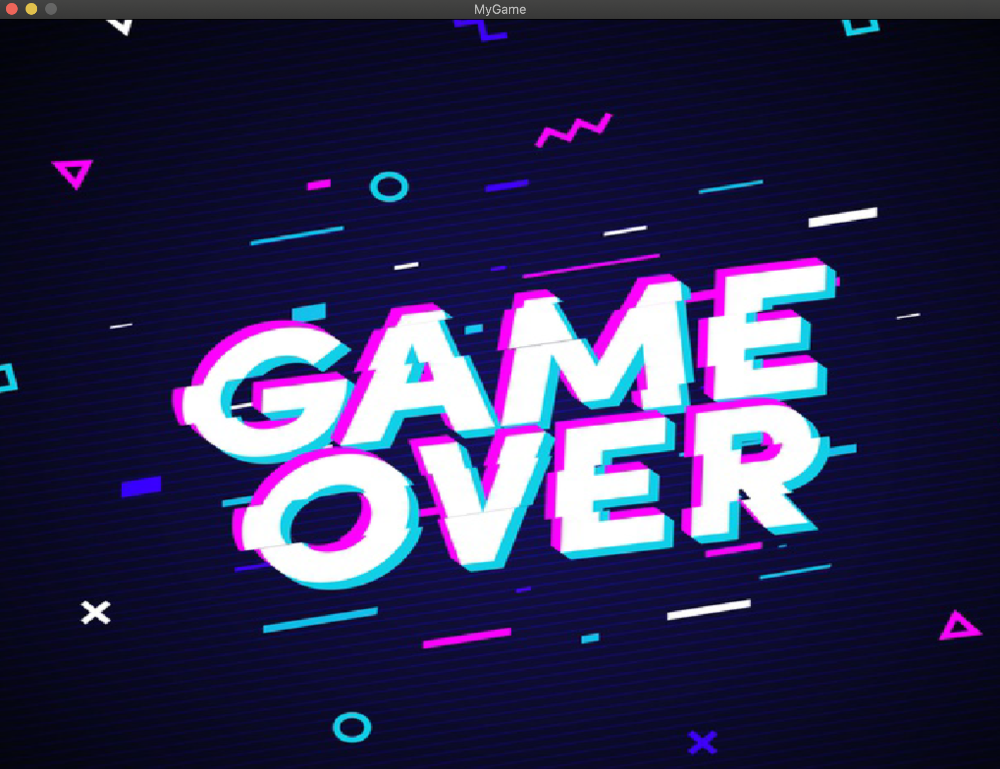

# Travail pratique 3 : Le jeu *Circles*

## Description

Ce projet est une petite réplique du jeu vidéo Super Hexagon de Terry Cavanagh
codé en c pour le cours INF3135 de l’Université du Québec à Montréal.

## Auteurs

- Yacin

## Dépendances

Avant de commencer, certaines dependances sont necessaire au fonctionnement
du jeu. Il est necessaire d'installer une librairie graphique afin de pouvoir
faire compiler et demarrer le jeu.

- SDL2 
- SDL2_image
- SDL2_gfx
- SDL2_mixer

Avant de commencer, certaines dépendances sont nécessaires au fonctionnement du 
jeu. Il est nécessaire d'installer une librairie graphique afin de pouvoir faire compiler et démarrer le jeu.

## Fonctionnement
Pour faire fonctionner le programme, il faut d'abord le compiler et ensuite 
l'exécuter. Pour ce faire, tapez la commande `make` dans le répertoire du projet
à l'aide du terminal. Cette commande va compiler le projet et générer
l'exécutable nommé cercles a l'intérieur du fichier src du projet. Il ne 
reste plus qu'a l'exécuter a l'aide de la commande ./src/circles .

**Le Menu Principale**

**Une partie en cours**

**Game over!**

Have fun
## Plateformes supportées

 - MacOS
 - Unix

## Références

Stackoverflow.com & le jeu Maze mentionné dans l'enoncer.

## Division des tâches

Tout a ete fait par moi :)

* [X] Gestion du menu (Alice)
* [X] Affichage de la scène (Bob)
* [X] Affichage du chronomètre (Carl)
* [X] Animation des murs (Bob)
* [X] Animation du joueur (Alice)
* [X] Détection des collisions (Carl)
* [X] Affichage d'une partie terminée (Bob)
* [X] Gestion de la musique principale (Alice)
* [ ] Gestion des sons lorsqu'on navigue dans le menu (Alice)
* [ ] Gestion de la musique de fin de partie (Carl)

## État du projet

Fini.

Note: Le jeu n'est évidemment pas super bien optimiser au niveau du level design 
et de la dfficultee. Il est par contre facile de modifier certains paramètres
dans mon code pour arranger la difficulté ou bien faire tourner les arcs en mouvement en modifiant quelques valeurs.

